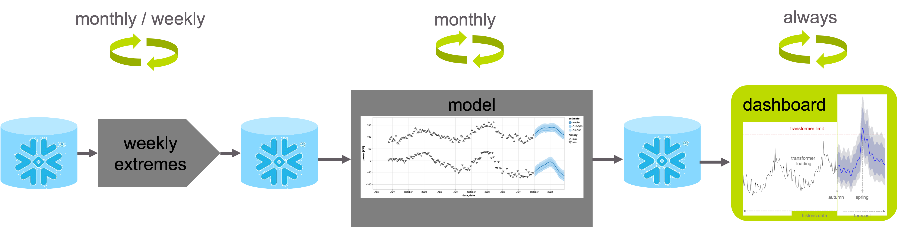

# 21_Spark

Personal JADS project of Bram Vonk called Spark that covers medium-term load forecasting on DALI data.
See the [documentation](https://bram-vonk.github.io/21_Spark) for more details.

The main steps are depicted above. These steps can be run via a Docker container:
* run `docker-compose run update_extremes` for to update the table with weekly extremes.
* run `docker-compose run make_forecasts ` to tune the model, forecast transformer loadings and store the results.
* ~~run `docker-compose run run_dashboard` to run the dashboard to view results.~~ (to be implemented).