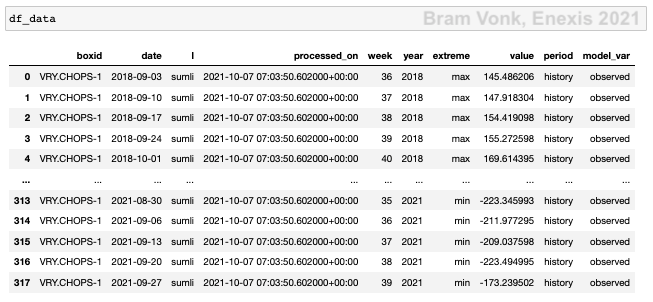

Data Preparation
================

The data preparation step focuses on converting raw measurement data with a frequency of 15 minutes into weekly extremes and preparing these extremes to be usable input for the forecasting model.

Initially the entire history is aggregated and stored in a Snowflake database. Consecutively, updates are done every week.

.. image:: _static/img/process_data_preparation.png
    :height: 250px
    :align: center

The data preparation step resulting in weekly aggregated data.

Data Selection
--------------

Columns described in :ref:`Data Understanding` are selected from the measurement data and metadata tables.

From the measurement data only data is selected from DALI boxes that have nominal power registered in the metadata table and that are in operation (:meth:`src.utils.snowflake.read_meta`). Both data and metadata are needed to indicate future overloading and add value to Grid Planners.

As mentioned only the active power (P) on medium voltage side is used initially. Apparent power (S) is preferred (for a more fair comparison with the nominal power), but since this is 15 minute average data, this is hard to reconstruct.

In this step the separate power phases are selected and processed as well as the sum of the phases (:meth:`src.utils.snowflake.make_week_extremes_query`).

Only the 15 minute average channels are selected for preprocessing.

Data Cleaning
-------------

No data cleaning is performed on the raw data before aggregation, but data is checked and cleaned on the following after loading (:meth:`src.preprocess.preprocess.load_data`) and before being used by a model for forecasting:

* Data of extremes (minimum or maximum) having the value of zero in the beginning of the series are removed (:meth:`src.preprocess.preprocess.remove_leading_idling`). This is for example the case if a DALI box is in operation, but its transformer is not.
* Only data is used that has a history of more than two years (:meth:`src.preprocess.preprocess.too_short`). This will ensure in this stage that the seasonality (sub)model has enough data to tune on.
* Only data is used of transformers that have a measurement in their history with an absolute value higher than half the transformer capacity (:meth:`src.preprocess.preprocess.too_small`).

Duplicate data (can only be created by updating the extreme table) is not an issue for the model and will not be eliminated.

Missing data is neither a problem for the model and is also not imputed.

Data Construction
-----------------

From the raw 15-minute data the weekly minimum and maximum are determined. This is done per channel and boxid (:meth:`src.utils.snowflake.make_week_extremes_query`).
The week definition used is the ISO-week since this is always a full week.

A SQL query aggregates and writes the result asynchronously on the Snowflake database. This can be done in batch for all historic measurements (:meth:`src.utils.snowflake.create_week_extremes`), but the created table can also be updated per week (:meth:`src.utils.snowflake.update_week_extremes`).

.. list-table:: Snowflake table details for weekly extremes data.
   :widths: 25 25
   :header-rows: 0

   * - Database
     - DB_DATASCIENCE_P
   * - Schema
     - DATASCIENCE_1_ETL
   * - Table
     - DS_SPARK_DALI_WEEK_EXTREMES

The fields of the table are listed below. The table is clustered by BOXID and L (phase).
The amount of rows is condensed from 89,052,020,404 to 3,457,856 records.

.. list-table:: Extremes table fields.
   :widths: 25 25 50
   :header-rows: 1

   * - Field
     - Type
     - Example
   * - BOXID
     - VARCHAR
     - ESD.000240-2
   * - L
     - VARCHAR
     - sumli
   * - YEAR
     - NUMBER
     - 2021
   * - WEEK
     - NUMBER
     - 53
   * - PROCESSED_ON
     - TIMESTAMPTZ
     - 2021-05-12 07:45:00.000000000
   * - MAX
     - DOUBLE
     - 678.90
   * - MIN
     - DOUBLE
     - 123.45

Data Integration
----------------

Since no additional data sources are used, no joins or merges are required.

Data Formatting
---------------

The model does not demand an order (e.g. by year and week) of the data.
For the modelling stage the data is queried from the table in `Data Construction`_

Consecutively, a date column is constructed from the ISO year and week format with day==1.

The extra columns period and model_var are assigned and filled with the values "history", "observed" respectively for measurement data.
This is in preparation for long formatting and concatenating forecast results in a later stage (:meth:`src.preprocess.preprocess.format_data`).

An example of the loaded extreme data is shown below:

The format of the loaded extremes data.

Data Updating Process
---------------------

The weekly extremes can be updated on a weekly (or longer) basis.

By running :meth:`src.preprocess.update_extremes` the function :meth:`src.utils.snowflake.update_week_extremes` is called.
This will will trigger the following steps which update the weekly extremes Snowflake table:

.. image:: _static/img/preprocessing_details.png
    :width: 400px
    :align: center

The detailed process to create and assess load forecasts.