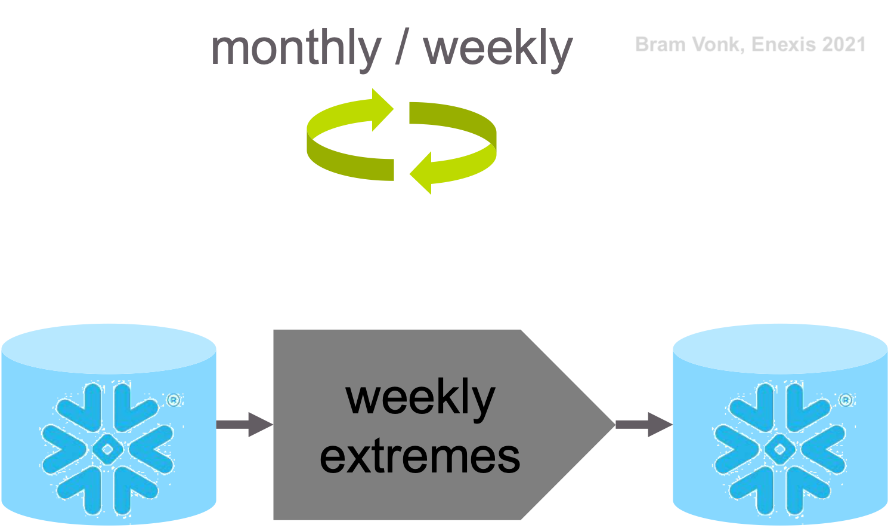

Data Preparation
========

The data preparation step focuses on converting raw measurement data with a frequency of 15 minutes into weekly extremes and preparing these extremes to be usable input for the forecasting model.

Initially the whole history is aggregated and stored in a Snowflake database. After that updates are done every month / week.

The data preparation step resulting in weekly aggregated data.

Data Selection
----------

Columns described in :ref:`Data Understanding` are selected from the measurement and metadata tables.

From the measurement data only data is selected from DALI boxes that have nominal power registered in the metadata table and that are in operation.

As mentioned only the active power on medium voltage side is used initially.
In this step the separate power phases are selected and processed as well as the sum of the phases.
Only the 15 minute average channels are selected for preprocessing.

Data Cleaning
----------

Data Construction
----------

Data Integration
----------

Data Formatting
----------