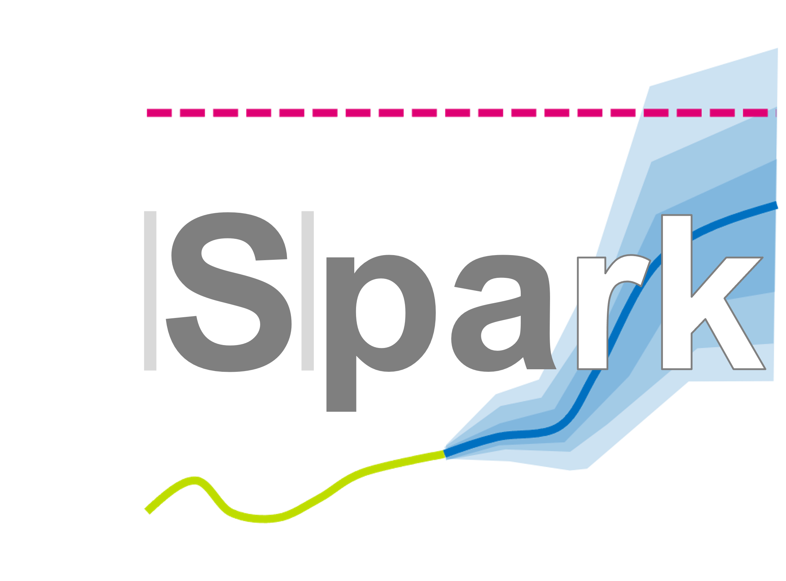

Spark documentation
===================================================

.. note:: | This project is an Enexis case on forecasting load demand for distributon transformers.
          | The results should support grid planners with timely grid reinforcements and replacements.
          | The case is used as a graduation project for the Professional Education program of the Jheronimus Academy of Data Science

.. toctree::
   :maxdepth: 2
   :caption: Contents:

   general
   business_understanding
   data_understanding
   data_preparation
   modeling
   evaluation
   deployment
   autoapi/index